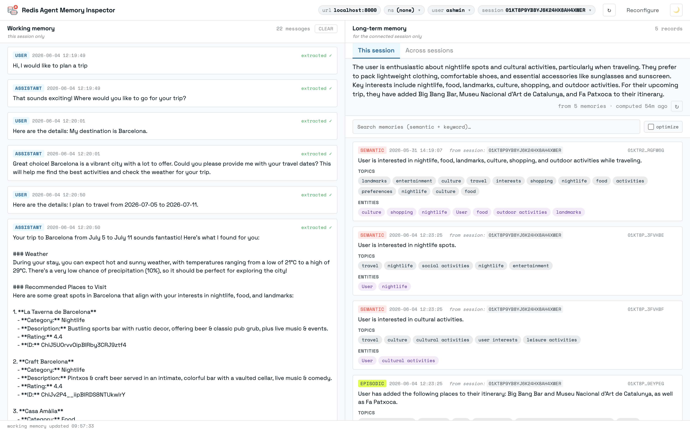

# Redis Agent Memory Inspector

A Chrome extension that shows what an Agent Memory backend is holding for a given user - working memory on the left, long-term memory on the right, both auto-refreshing.



## Who it's for

- **DevRel & solutions engineers** - drop it onto any demo to show what's happening in memory live; no need to build a custom viewer or memory panel for every new demo or talk you create.
- **Teams building agent apps** - debug memory issues during development without.
- **Workshops & tutorials** - give learners a clear window into how extraction, search, and retention actually behave.

## Backends

Works with either:

- **[Redis Agent Memory Server](https://github.com/redis/agent-memory-server)** - the open-source server you self-host (e.g. via Docker)
- **[Redis Agent Memory](https://redis.io/docs/latest/develop/ai/context-engine/agent-memory/)** - the hosted service on Redis Cloud (Iris / Context Engine)

Pick the backend from the connect panel; the rest of the UI is identical.

## What it shows

| Pane | Scope | What it shows |
| --- | --- | --- |
| **Working memory** (left) | Current `session_id` only | Message log, role tags, per-message `discrete_memory_extracted` flag, the running summary if Redis Agent Memory has generated one |
| **Long-term memory** (right) | All sessions for `user_id` (+ optional `namespace`) | Extracted memories, type badges (`semantic` / `episodic` / `message`), topic + entity chips, originating `session_id`, similarity score when search is active |

## Repository layout

```
chrome-extension/   the unpacked extension Chrome loads
proxy/              optional transparent proxy for Cloud (see "Known issues")
```

## Installation

1. Open `chrome://extensions`.
2. Toggle **Developer mode** on.
3. **Load unpacked** and pick the `chrome-extension/` folder.
4. Pin the extension to the toolbar.

## Usage

Click the toolbar icon to open the connect panel:

- **Backend** - pick **OSS server** (Redis Agent Memory Server) or **Redis Cloud** (Redis Agent Memory service)
- **Redis Agent Memory Server URL / Endpoint** - e.g. `http://localhost:8000` for OSS, or the Cloud endpoint (e.g `https://gcp-us-east4.memory.redis.io`)
- **Working / Long-term memory refresh** - in seconds (default 3s and 5s)
- **Store ID** - Cloud only; the store identifier from the Redis Cloud console
- **API Key** - Cloud only; the bearer token from the Redis Cloud console
- **Proxy URL** - Cloud only, optional; override the built-in default


Click **Connect**.

## Once connected

| Action | Where | Effect |
| --- | --- | --- |
| Switch long-term scope | **This session** / **Across sessions** tabs at top of the right pane | Filters between memories extracted from the connected session only and all memories for the user. |
| View summary | Session summary for long term memory | Auto-generated summary of what Redis Agent Memory has learned about the user (or this session, depending on the active scope). |
| Recompute the summary | `↻` button inside the summary banner | Redis Agent Memory rebuilds the summary now - useful after a recent memory change. |
| Search long-term memory | Search box top of the right pane | Hybrid (vector + keyword) search via `/v1/long-term-memory/search`. Score pill appears on each card. |
| Toggle `optimize_query` | Checkbox next to the search box | LLM-rewrites the query server-side before searching. |
| Filter by topic / entity | Click any chip inside a card | Adds to the active filter; pills above the cards let you remove or clear |
| Delete a long-term memory | Hover any card → `✕` top-right | `DELETE /v1/long-term-memory?memory_ids=…`, confirms first |
| Clear working memory | `Clear` button in the working pane header | `DELETE /v1/working-memory/{session_id}`, confirms first |
| Refresh now | `↻` in the header | Immediate poll of both panes |
| Reconfigure | `Reconfigure` link in the header | Back to the connect form |

## Note for Cloud users

Direct fetches to `*.memory.redis.io` are blocked by Cloudflare bot detection. Route through the included [`proxy/`](./proxy/) - `cd proxy && npm start` runs it locally on `:8787`, or deploy it to any Web-fetch runtime - and put its URL in the **Proxy URL** field of the connect panel.

## License

MIT.
