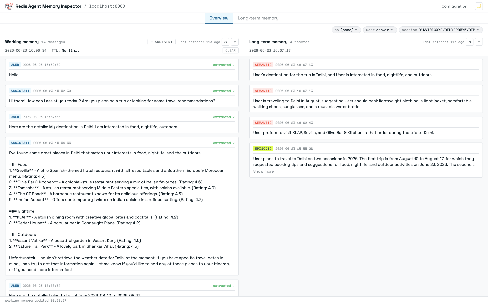
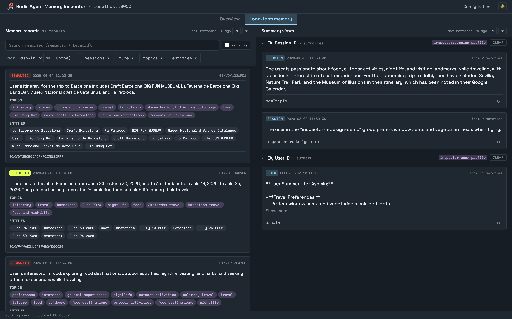
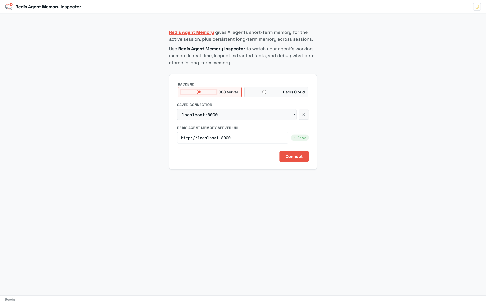

# Redis Agent Memory Inspector

A Chrome extension for inspecting and managing your Agent Memory backend on Redis.






## Who it's for

- **DevRel & solutions engineers** - drop it onto any demo to show what's happening in memory live; no need to build a custom viewer or memory panel for every new demo or talk you create.
- **Teams building agent apps** - makes debugging memory issues during development easier than digging through raw Redis keys.
- **Workshops & tutorials** - give learners a clear window into how extraction, search, and retention actually behave.

## Backends

Works with either:

- **[Redis Agent Memory Server](https://github.com/redis/agent-memory-server)** - the open-source server you self-host (e.g. via Docker)
- **[Redis Agent Memory](https://redis.io/docs/latest/develop/ai/context-engine/agent-memory/)** - the hosted service on Redis Cloud (Iris / Context Engine)

Pick the backend from the connect panel; the rest of the UI is identical.

## What it shows

Two tabs: **Overview** and **Long-term memory**.

**Overview** — the live session for the selected `user_id` / `namespace` / `session_id`:

| Pane | What it shows |
| --- | --- |
| **Working memory** (left) | Message log, role tags, per-message `discrete_memory_extracted` flag, the session's created time and TTL, and the running summary if one has been generated |
| **Long-term memory** (right) | The latest extracted memories for the selected session |

**Long-term memory** — a standalone explorer with its own search and filters:

| Pane | What it shows |
| --- | --- |
| **Memory records** | Every extracted memory with type badge (`semantic` / `episodic` / `message`), topic + entity chips, key name, originating `session_id`, and a similarity score when a text search is active. Search, server-side filters (user/owner, namespace, sessions, type, topics, entities), and per-record delete. |
| **Summary views** | LLM-computed profiles as one collapsible section per view (e.g. by user, by session); each card shows the summary, when it was computed, and how many memories it drew from |

## Repository layout

```
chrome-extension/   the unpacked extension Chrome loads
proxy/              optional transparent proxy for Cloud (see "Known issues")
```

## Installation

1. Open `chrome://extensions`.
2. Toggle **Developer mode** on.
3. **Load unpacked** and pick the `chrome-extension/` folder.
4. Pin the extension to the toolbar.

## Usage

Click the toolbar icon to open the connect panel:

- **Backend** - pick **OSS server** (Redis Agent Memory Server) or **Redis Cloud** (Redis Agent Memory service)
- **Redis Agent Memory Server URL / Endpoint** - e.g. `http://localhost:8000` for OSS, or the Cloud endpoint (e.g `https://gcp-us-east4.memory.redis.io`)
- **Store ID** - Cloud only; the store identifier from the Redis Cloud console
- **API Key** - Cloud only; the bearer token from the Redis Cloud console
- **Proxy URL** - Cloud only, optional; override the built-in default



Click **Connect**.

## Note for Cloud users

Direct fetches to `*.memory.redis.io` are blocked by Cloudflare bot detection. Route through the included [`proxy/`](./proxy/) - `cd proxy && npm start` runs it locally on `:8787`, or deploy it to any Web-fetch runtime - and put its URL in the **Proxy URL** field of the connect panel.

## License

MIT.
